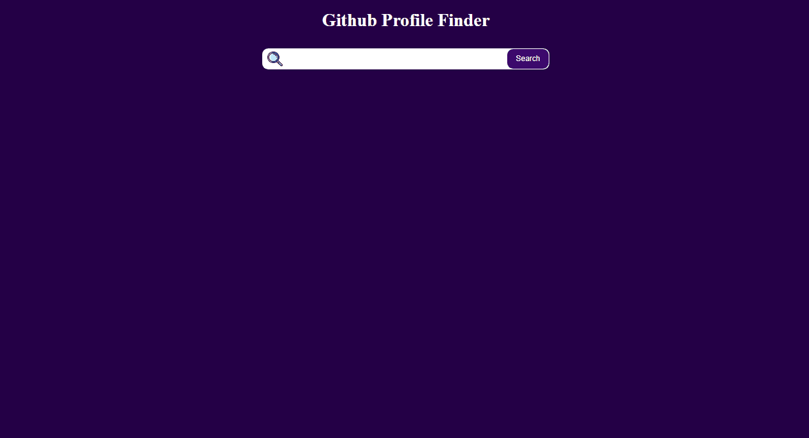

<h1 align="center" style="border-bottom: none">Github Profile Finder</h1>

<h2 style="margin-top: 2rem" id="links">Navigation Links</h2>

  <a href="#descricao">Descrição</a>  |
  <a href="#desktop">Desktop</a>  |
  <a href="#mobile">Mobile</a>  |
  <a href="#tecnologias">Tecnologias</a>  |
  <a href="#testeaqui">Teste Aqui</a>  |
  <a href="#autor">Autor</a>  

 

<h2 id="descricao" >Descrição</h2>

Github Profile Finder é uma aplicação para buscar perfils no github, consumindo uma api disponibilizado pelo próprio github.

<h2 id="desktop">Desktop</h2>
 

  

 

 

<h2 id="mobile">Mobile</h2>
 

  

 

 

<h2 id="tecnologias">Tecnologias</h2>
 

As seguintes tecnologias foram usadas nesse mini projeto:

- [Html](https://developer.mozilla.org/pt-BR/docs/Web/HTML)
- [Css](https://developer.mozilla.org/pt-BR/docs/Web/CSS)
- [JavaScript](https://developer.mozilla.org/pt-BR/docs/Web/JAVASCRIPT)

 

<h2 id="testeaqui">Teste Aqui</h2>

<a href="https://diogofranca.github.io/memory-game/">Github pages</a>

 

<h2 id="autor">Author</h2>
Made with ❤️ by Diogo França 🎉

 

